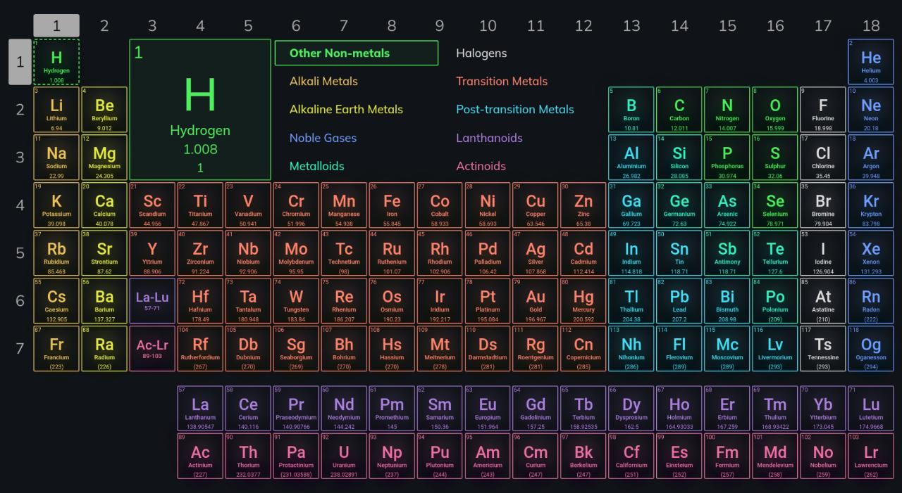

# [ Periodic Table](https://rupansamanta.github.io/periodic-table)

## Introduction
The Periodic Table provides an interactive way to explore information about chemical elements. It is built using HTML, CSS, JavaScript, and jQuery.

## Features
- Interactive display of the periodic table.
  
- Click on an element to view details.
  
-  Double Clicking on an element reveals detailed information.
- 2D Orbital Structure for all elements with pause (hold) and stop (double-click) feature.
- Color-coded for easy identification of element groups.
- Highlight all elements of a particular group, period or type by clicking.
- Search for elements using names, symbols, or atomic numbers of the elements.

## Demo
[Live Demo](https://rupansamanta.github.io/periodic-table)
